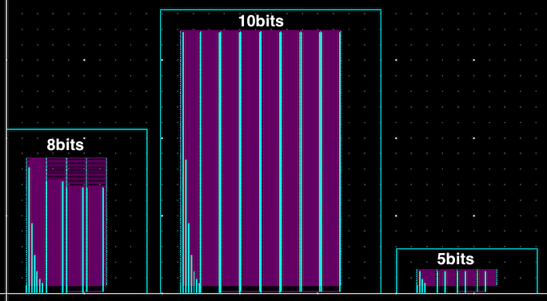
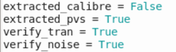
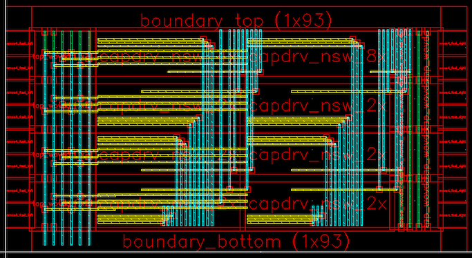
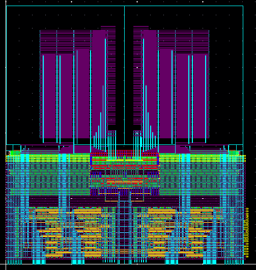
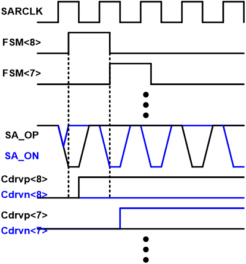
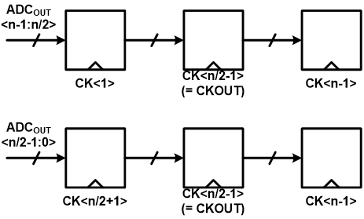

# Time-interleaved SAR ADC generator

The TISARADC generator has been completely refactored/fixed by Woorham Bae. Please carefully read this document. (Sep. 4. 2018)

This section describes the process of generating a time-interleaved SAR ADC
schematic and layout using BAG and laygo.

## Overview

Time Interleaved Successive Approximation ADC (TISARADC) is a popular
way of implementing a moderate precision (4-10 bits) ADC that operates
at higher sampling rates than single SAR ADCs can achieve. As an example
 of demonstrating the automated analog and mixed signal circuits
 generation flow, the entire TISARADC generator is explained here.

## Installation

1. Set up a BAG/laygo working directory for the your technology.
For example, cds_ff_mpt environment can be set up by running the
following commands.

    ```
    $ git clone git@github.com:ucb-art/BAG2_cds_ff_mpt.git
    $ cd BAG2_cds_ff_mpt
    $ git submodule init
    $ git submodule update
    $ git submodule foreach git pull origin master
    ```

    > Note: Workspaces are already set up for BWRC users, for some technologies, to skip step 2,3,5,6. Check ```git@bwrcrepo.eecs.berkeley.edu:jdhan/TISARADC_technologyname.git``` and use the corresponding repo if exists.

2. Copy configuration files and design libraries from
laygo/generators/adc_sar/yaml by typing:

    ```
    cp laygo/generators/adc_sar/yaml/adc_sar_spec.yaml .
    cp laygo/generators/adc_sar/yaml/adc_sar_size.yaml .
    cp -r laygo/generators/adc_sar/BagModules/adc_sar_templates BagModules/
    cp -r laygo/generators/adc_sar/adc_sar_templates .
    cp -r laygo/generators/adc_sar/adc_sar_testbenches .
    ```

    > Note: some repos may already have those files in their working
    directories.

3. Add library definitions to your cds.lib (some distributions use cds.lib.core instead of cds.lib)

    *In cds.lib*
    ```
    DEFINE adc_sar_templates ./adc_sar_templates
    DEFINE adc_sar_testbenches ./adc_sar_testbenches
    ```

3. Open bag_lib.defs and remove the definition of adc_sar_templates if
exist

    *In bag_lib.defs*
    ```
    adc_sar_templates BagModules #remove this
    ```

4. Run virtuoso and type the following command in CIW.
    ```
    load "start_bag.il"
    ```

5. Open **adc_sar_templates/capdac** and update the library name of C0 and
 CDAC0 to **(technology_name)_micretemplates_dense**, as shown below.

    

6. Launch bag and run the following import script.

    ```
    run laygo/generators/adc_sar/adc_sar_import.py
    ```

5. In the IPython interpreter, type the following command to construct
the template and grid database. (Make sure proper techlib is attached
to the microtemplate library)

    ```
    run laygo/labs/lab2_a_gridlayoutgenerator_constructtemplate.py
    ```

6. Run the following command to generate the logic gate template
library. The library name will be (technology_name)_logic_templates.

    ```
    run laygo/generators/logic/logic_templates_layout_generator.py
    ```

## Setting up parameters

ADC schematic and layout are constructed based on spec/size parameters
defined in 2 configuration files in **YAML** format
(**adc_sar_spec.yaml, adc_sar_size.yaml**).

Following parameters are defined in the configuration files:

1. adc_sar_spec.yaml

    * **temp**: nominal temperature
    * **temp_min**: minimum temperature
    * **temp_max**: maximum temperature
    * **v_in**: nominal input swing (single ended)
    * **v_in_max**: maximum input swing
    * **v_in_cm**: nominal inpuut common mode
    * **n_bit**: number of output bits
    * **n_bit_cal**: number of output bits after digital calibration
    * **fsamp**: effective sampling rate
    * **n_interleave**: interleaving ratio
    * **c_unit**: minimum unit capacitance of CDAC
    * **c_ground**: grounded parasitic capacitance of c_unit
    * **c_delta**: maximum capacitance mismatch of c_unit (normalized by
    c_unit)
    * **n_bit_samp_noise**: standard deviation of sampling noise (in bits)
    * **n_bit_samp_settle**: maximum sampler settling error in bits
    * **n_bit_comp_noise**: standard deviation of comparator noise in bits
    * **rdx_array**: CDAC radix array
    * **rdx_enob**: Target ENOB after calibration
    * **cycle_comp**: Comparator timing budget in cycle
    * **cycle_logic**: Logic timing budget in cycle
    * **cycle_dac**: DAC timing budget in cycle
    * **vdd**: nominal supply voltage
    * **vdd_min**: minimum supply voltage
    * **vdd_max**: maximum supply voltage
    * **trf_fo4**: nominal logic transition timing
    * **tfo4**: nominal fo4 delay
    * **samp_use_laygo**: True if laygo is used for sampler generation. If false, AnalogBase is used
    * **samp_with_tgate**: True if T-gate sampler is used. IF false, NMOS-only sampler is used. Valid only if laygo is used for sampler generation.
    * **ret_use_laygo**: True if laygo is used for retimer generation. If false, AnalogBase is used
    * **pmos_body**: Default: VDD. Use VSS if flipped well is used.
    * **use_offset**: True if offset calibration is used for the comparator.
    * **clk_pulse_overlap**: Default: False. If true, sampling clock pulses for adjacent ADC slices will be overlapped.

2. adc_sar_size.yaml
    * **device_intent**: device intent (i.e. standard, lvt, hvt)
    * **lch**: device channel length
    * **nw**: width (number of fins) of unit NMOS
    * **pw**: width (number of fins) of unit PMOS
    * **capdac**
        * **c_m**: multiplier of CDAC unit capacitor
        * **num_bits_horizontal**: CDAC number of bits in horizontal direction
        * **num_bits_vertical**: CDAC number of bits in vertical direction
    * **capdrv**
        * **m_list**: cap driver multiplier list
        * **space_offset**: cap driver spacing parameter, for routing
    * **salatch**
        * **doubleSA**: True if double-tail sense amplifier is used
        * **m**: strongArm latch input device sizing
        * **m_buf**: strongArm latch output buffer sizing
        * **m_d**: double-tail SA (second stage) input device sizing
        * **m_rgnn**: strongArm latch regenerative latch sizing
        * **m_rgnp_d**: double-tail SA (second stage) regenerative latch sizing
        * **m_rst**: strongArm latch reset device sizing
        * **m_rst_d**: double-tail SA (second stage) reset device sizing
    * **sarfsm**
        * **m**: SAR FSM sizing
    * **sarlogic**
        * **m**: SAR logic sizing
        * **num_inv_bb**: Length of inverter chain for bottom-plate timing calibration
    * **sarclkgen**
        * **fast**: Fast mode - forced negative SARCLK (comparator clock) edge
        * **fo**: SARCLK buffer fanout
        * **m**: SARCLK generator sizing
        * **ndelay**: For fast mode, # of delay units for negative edge
    * **sarret**
        * **m**: SAR logic output retimer sizing
        * **fo**: SAR logic output retimer buffer fanout
    * **sarabe_m_space_left_4x**: number of space cells
    * **sarabe_supply_rail_mode**: Default:0. If VDD/VSS short is observed in "sar" hierarchy, use 1 and regenerate sarabe.
    * **sampler_nmos**: for AnalogBase sampler
        * **fg_inbuf_list**: input sampling clock buffer sizing
        * **fg_outbuf_list**: output sampling clock buffer sizing
        * **fgn**: sampler sizing
        * **nduml**: # of dummy at the left side
        * **ndumr**: # of dummy at the right side
        * **wn**: NMOS width
        * **wp**: PMOS width
    * **sarsamp**: for Laygo sampler
        * **m_inbuf_list**: input sampling clock buffer sizing
        * **m_outbuf_list**: output sampling clock buffer sizing
        * **m_sw**: unit sampler sizing
        * **m_sw_arr**: # of unit sampler
    * **slice_order**: Order of ADC slices, even number on the left side
    * **clk_dis_capsw**
        * **m**: clock generator capdac driving switch sizing
    * **clk_dis_cell**
        * **m_dff**: DFF sizing
        * **m_inv1**: DFF Q buffer sizing (1st)
        * **m_inv2**: DFF Q buffer sizing (2nd)
        * **m_tgate**: Clock output tgate sizing
    * **clk_dis_cdac**
        * **m**: multiplier of CDAC unit capacitor
        * **num_bits**: CDAC number of bits
    * **clk_dis_htree**
        * **m_clko**: number of tracks for clk_dis output clock
        * **m_track**: number of tracks for input clock H-tree
    * **retimer**
        * **ret_m_ibuf**: input clock buffer sizing (last stage: ret_m_ibuf x 16)
        * **ret_m_latch**: retimer latch sizing
        * **ret_m_obuf**: output clock buffer sizing (ret_m_obuf x 4)
        * **ret_m_sr**: duty-cycle correcting SR latch sizing
        * **ret_m_srbuf**: SR latch output buffer sizing

For the starting point, following preset files are provided. They are
not 100% finalized, but will serve well for initializations.

1. **laygo/generators/adc_sar/yaml/adc_sar_spec(size).yaml** : 8-way interleaved, 9bit ADC with digital
calibration.


## TISARADC architecture

TISARADC is composed of 4 parts in the top level: ADC core, clock
generator, output retimer and biasing.

* The **ADC core** performs the actual conversion operation. It is
composed of multi-phased sampling frontend and N subADC that
converts the actual ADC operation at (sampling_rate/N), where N is
the interleaving ratio.
* The **clock generator** receives the high frequency clock at sampling
rate, generates multi-phased clock for the interleaved ADC operation.
* The **output retimer** receives the output from the ADC core, aligns
multi-phased signals to a single clock to be received by the
following digital backend.


## SubADC frontend layout generation

The frontend of subADCs is composed of three parts: capdac (CDAC),
strongArm comparator (salatch), cap driver (capdrv). In the proposed
flow, the 'very' frontend sampling switches are not the part of
 subADC frontend because they are designed separately, but obviously
 this is not the only way of partition.

1. The first block to be generated is CDAC, since this generator
assumes the horizontal dimension is limited by CDAC size in x-direction.
In order to generate CDAC layout, type:

    ```
    run laygo/generators/adc_sar/adc_sar_capdac_layout_generator.py
    ```

    This command will create a CDAC layout in
    **adc_sar_generated/capdac**, as shown below.

    

    * The capdac generator reads **n_bit** and **rdx_array** parameters
    from **adc_sar_spec.yaml**, and **capdac_c_m**,
    **capdac_num_bits_vertical**, **capdac_num_bits_horizontal**
    parameters from **adc_sar_size.yaml** (or use default settings in
    the python code if **load_from_file** is set to **false**), users
    can update those parameters and regenerate the capdac. It will
    create a new CDAC with different shapes, as shown below.

    

    

    * If you want to generate the schematic as well, type:

        ```
        run laygo/generators/adc_sar/adc_sar_capdac_schematic_generator.py
        ```

        The figure shown below is one example of generated schematic.
        Note that CDAC capacitors (I0-I7) are arrayed, with radix
        parameters specified by **rdx_array**.

    

    * The schematic generation is not required for full-ADC
    generations, since you can generate the whole ADC schematic by
    running a top-cell generation script (unlike the layout counterpart,
    which requires running several scripts in series to generate the
    entire ADC). The CDAC schematic generation is used for cell level
    verifications though, such as LVS or transfer curve extraction. For
    LVS, type:

        ```
        run laygo/generators/adc_sar/adc_sar_capdac_lvs.py
        ```

        It will give a **lvs passed**  message if the design is LVS
        clean.

        >Note: BAG2_cds_ff_mpt / FreePDK45 does not support LVS &
        extraction at this moment. Skip these steps for those processes

    * For parasitic extraction, type the following command.

        ```
        run laygo/generators/adc_sar/adc_sar_capdac_extract.py
        ```

        > Note: this step could take a long time, depending on your
        extraction setup. Skip this if you just want to quickly go
        through steps.

    * You can run simulations on CDAC via BAG framework. The following
    command will launch the transfer curve simulation with
    schematic netlists. For the post-extract simulation, set
    **extracted = True** in the script.

        ```
        run laygo/generators/adc_sar/adc_sar_capdac_verify.py
        ```

        

        

        


2. After CDAC generation, PMOS-input sense amplifier layout can be generated by
running:

    ```
    run laygo/generators/adc_sar/adc_sar_salatch_pmos_layout_generator.py
    ```

    

    Note that the generator assumes the sense amplifier width is narrower than 2x of the CDAC width.

    * Two topologies available: StrongArm latch and double-tail sense amplifier
    * Here are additional scripts regarding the strongArm latch:

        1. **adc_sar_salatch_pmos_size.py**: transistor size calculator

        

        2. **adc_sar_salatch_pmos_schematic_generator.py**: schematic
        generation
        3. **adc_sar_salatch_pmos_schematic_lvs.py**: LVS
        4. **adc_sar_salatch_pmos_schematic_extract.py**: RC extraction
        5. **adc_sar_salatch_pmos_verify.py**: verifications (clk-q,
        noise)

        

3. The next step is generating capacitor drivers that drive CDAC. Run
the following scripts:

    ```
    run laygo/generators/adc_sar/adc_sar_capdrv_nsw_layout_generator.py
    run laygo/generators/adc_sar/adc_sar_capdrv_nsw_array_layout_generator.py
    ```

    This is a 2-step generation; in the first script, individual driver
    cells are generated. The second script places driver cells (with
    the sizing parameters defined by **capdrv_m_list** in
    **adc_sar_size.yaml**.

    

    

    Here's one example layout of the capdrv.

    

    Here's the capdrv_array layout (primitive cells are hidden).

    

4. Now it's time to generate the frontend top layout/schematic. Type:

    ```
    run laygo/generators/adc_sar/adc_sar_sarafe_nsw_layout_generator.py
    run laygo/generators/adc_sar/adc_sar_sarafe_nsw_schematic_generator.py
    run laygo/generators/adc_sar/adc_sar_sarafe_nsw_lvs.py
    ```

    The commands will create a layout (and schematic) of **sarafe_nsw**,
    which is the frontend top of subADC, and run LVS. Try different
    presets introduced before and see if designs are generated properly.

    

## SubADC backend layout generation

1. The backend of subADCs is composed of FSM(sarfsm), SAR logic(sarlogic),
clock generator(sarclkgen), and retimer(sarret).

    

    * SAR FSM: generates window signals that determines which SAR bit
    corresponds to the current sense amplifier output.

    * SAR logic: generates capdac control signal

    

    There are two path to the SAR logic, SA output and CLKgen/FSM,
    so timing between them should be checked. (t_ckgen + t_fsm + t_hold < T_SARCLK/2)

    

    Timing check script: adc_sar_sarabe_dualdelay_verify.py

    * SAR clock generator: generates the asynchronous clock for SAR search operation
        * Fast mode on: clock pulsewidth is adjusted by a variable delay line. Clock pulse becomes narrower, eventually disappears.

        

        * Fast mode off: More like a ring oscillator. Clock pulse will not disappear.

        

    * SAR retimer: retimes the SAR logic output from the asynchronous clock domain with the synchoronous clock (sampling clock).

   *  SAR backend top

    

    Run following scripts to generate those building blocks.

    ```
    #FSM layout
    run laygo/generators/adc_sar/adc_sar_sarfsm_layout_generator.py
    #SAR logic
    run laygo/generators/adc_sar/adc_sar_sarlogic_wret_layout_generator.py
    run laygo/generators/adc_sar/adc_sar_sarlogic_wret_array_layout_generator.py
    #SAR clock generator
    run laygo/generators/adc_sar/adc_sar_sarclkdelay_layout_generator.py
    run laygo/generators/adc_sar/adc_sar_sarclkgen_core_static2_layout_generator.py
    run laygo/generators/adc_sar/adc_sar_sarclkgen_static_layout_generator.py
    #SAR retimer
    run laygo/generators/adc_sar/adc_sar_sarret_wckbuf_layout_generator.py
    #spacing elements for routing/filling
    run laygo/generators/adc_sar/adc_sar_space_layout_generator.py
    #SAR backend generation
    run laygo/generators/adc_sar/adc_sar_sarabe_dualdelay_layout_generator.py
    ```


2. For schematic generation, run scripts. Again, BAG is generating
schematics in hierarachical order, so you don't need to run these
scripts if you want to generate in top level.

    ```
    #FSM layout
    run laygo/generators/adc_sar/adc_sar_sarfsm_schematic_generator.py
    #SAR logic
    run laygo/generators/adc_sar/adc_sar_sarlogic_wret_array_schematic_generator.py
    #SAR clock generator
    run laygo/generators/adc_sar/adc_sar_sarclkgen_static_schematic_generator.py
    #SAR retimer
    run laygo/generators/adc_sar/adc_sar_sarret_wckbuf_schematic_generator.py
    #spacing elements for routing/filling
    run laygo/generators/adc_sar/adc_sar_space_schematic_generator.py
    #SAR backend generation
    run laygo/generators/adc_sar/adc_sar_sarabe_dualdelay_schematic_generator.py
    ```

3. The frontend and backend can be integrated by running following
scripts.

    ```
    # layout
    run laygo/generators/adc_sar/adc_sar_sar_layout_generator.py
    # schematic
    run laygo/generators/adc_sar/adc_sar_sar_schematic_generator.py
    ```

    

    * Use "sarabe_supply_rail_mode" in adc_sar_size.yaml to avoid VDD/VSS short.

## SubADC switch generation

The sampling frontend can be generated either from laygo or AnalogBase.
While the sampler generated from AnalogBase (written by Eric Chang) is
more flexible, associated APIs need to be set up (which is not for the
cds_ff_mpt technology), so laygo based sampler is used for this example.

Sizing script gives a simple calculation using the extracted MOS data.


Run the following script to generate the sampling switches.

```
# size
run laygo/generators/adc_sar/adc_sar_sarsamp_size.py
# layout
run laygo/generators/adc_sar/adc_sar_sarsamp_layout_generator.py
# schematic
run laygo/generators/adc_sar/adc_sar_sarsamp_schematic_generator.py
# testbench
run laygo/generators/adc_sar/adc_sar_sarsamp_verify.py
```


If the AnalogBase is set up for your technology, these scripts will
generate the sampling switches.

```
# layout
run laygo/generators/adc_sar/sampler_nmos_layout_generator.py
# schematic
run laygo/generators/adc_sar/sampler_nmos_schematic_generator.py
```
Note that the Laygo provides a transmission gate switch option, but the AnalogBase provides guardring option.

## SubADC top generation

If all subblocks are generated sucessfully, the SubADC top (sar_wsamp)
can be easily generated by placing and routing subcells. Run the following
scripts to generate the SubADC top.

```
# layout
run laygo/generators/adc_sar/adc_sar_sar_wsamp_layout_generator.py
# schematic
run laygo/generators/adc_sar/adc_sar_sar_wsamp_schematic_generator.py
```

The generated layouts shown below are from the full-stack subADC
generation with different settings (9b, 6b, 10bits and different
sizing parameters).


## SubADC testbench

Timing check: adc_sar_testbenches/sar_wsamp_9b_tb_tran_timing

Static testbench: adc_sar_testbenches/sar_wsamp_9b_tb_tran_static (ADC curve, calibration map, SNDR)


## Array generation

The SAR array can be easily made from running the following scripts.

```
# layout
run laygo/generators/adc_sar/adc_sar_sar_wsamp_array_layout_generator.py
# schematic
run laygo/generators/adc_sar/adc_sar_sar_wsamp_array_schematic_generator.py
```


## Clocking path generation

Zhongkai Wang and Woorham Bae made schematic and layout generators for the clock
generation. The clock generator is basically a shift-register based divider,
and each of the divided phaes is assinged to an ADC slice.
The order of ADC slices is free to change, as long as we do not mess up the even and odd order.


The clock generator provides two modes: short pulse mode (default) and 2x pulse mode.


Running following scripts will generate the clocking
frontend. (You don't need this for non-interleaving ADCs)

```
run laygo/generators/adc_sar/clk_dis_capsw_array_layout_generator.py
run laygo/generators/adc_sar/clk_dis_clk_dis_cell_layout_generator.py
run laygo/generators/adc_sar/clk_dis_capdac_layout_generator.py
run laygo/generators/adc_sar/clk_dis_viadel_cell_layout_generator.py
run laygo/generators/adc_sar/clk_dis_viadel_layout_generator.py
run laygo/generators/adc_sar/clk_dis_htree_layout_generator.py
run laygo/generators/adc_sar/clk_dis_viadel_htree_layout_generator.py
run laygo/generators/adc_sar/clk_dis_viadel_htree_schematic_generator.py
```

The following picture shows generated clocking paths for different
interleaving ratio settings


## Retimer

The retimer is generated either of Laygo and AnalogBase.




Laygo generator codes for the final retimer is written by Woorham Bae. Run
these scripts to generate the retimer schematic and layout.

```
run laygo/generators/adc_sar/tisaradc_retimer_layout_generator.py
run laygo/generators/adc_sar/tisaradc_retimer_schematic_generator.py
```

AnalogBase generator codes for the final retimer is written by Eric Chang. Run
these scripts to generate the retimer schematic and layout.

```
run laygo/generators/adc_sar/adc_retimer_layout_generator.py
run laygo/generators/adc_sar/adc_retimer_schematic_generator.py
```

## TISARADC body (clock+sar+retimer)

Following scripts are for generating layout and schematic of TISARADC
body.

```
run laygo/generators/adc_sar/tisaradc_body_core_layout_generator.py
run laygo/generators/adc_sar/tisaradc_body_core_schematic_generator.py
```


## Bias

## Top

## Full stack generation

in laygo/generators/adc_sar, there are various levels of full-stack
generators (generating all up to the specified hierarchy). Their filenames
end with **fullstack_generator.py**

## Contributors

The generator codes are written by Jaeduk Han, Woorham Bae, Eric Chang, Zhongkai Wang,
and Pengpeng Lu. This document is written by Jaeduk Han and Woorham Bae.